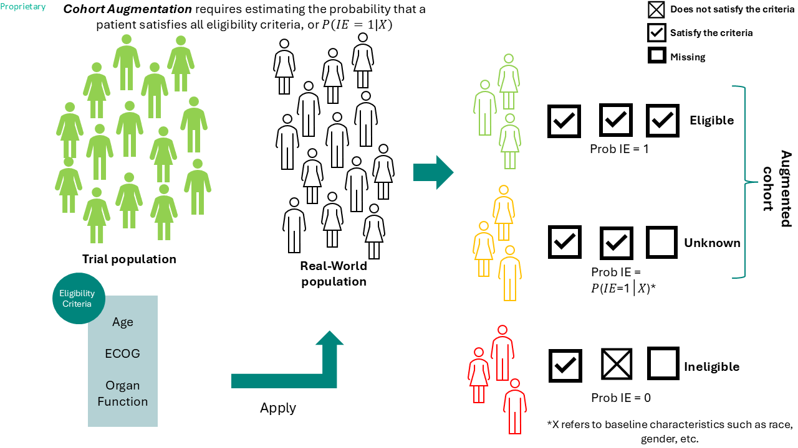
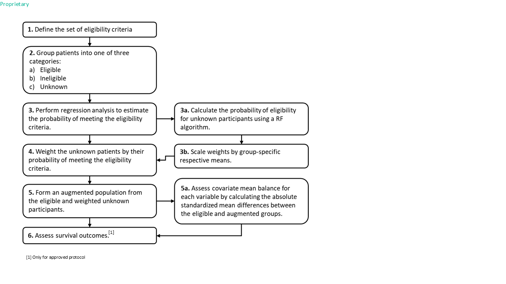

## Selected Data Parameters
**Clinical Trial Selection:** `r params$sel_trial`
**Real-world Dataset Selection:** `r params$sel_rwd`
**Cohort Selection:** `r params$sel_cohort`

## Selected Eligibility Criteria
```{r params$tbl_sel_ec, echo=FALSE}
params$tbl_sel_ec
```

## Selected Patient Characteristics
```{r params$tbl_sel_bsl_char, echo=FALSE}
params$tbl_sel_bsl_char
```

## Combinations of Eligibility Criteria Fulfilled Across Patients
```{r params$upset_plot, echo=FALSE, fig.width=12, fig.height=9}
upset_ret <- unserialize(serialize(params$upset_plot, NULL))

upset_ret[[2]]$theme$text <- element_text(family = 'Source Sans Pro', size = 24)
upset_ret[[3]]$theme$text <- element_text(family = 'Source Sans Pro', size = 24)
upset_ret[[3]]$layers[[3]]$aes_params$size <- 8
upset_ret[[3]]$theme$axis.title.x <- element_text(family = 'Source Sans Pro', size = 24)
upset_ret[[4]]$theme$text <- element_text(family = 'Source Sans Pro', size = 24)
upset_ret[[2]]$layers[[2]]$aes_params$size <- 5


upset_ret
```

## Methods
### Summary of Methods


### Methods Flow Chart


## Trial Eligibility Criteria
### Summary of Patient Eligibility Status
```{r params$attr_tbl_ec, echo=FALSE, fig.height=8}
params$attr_tbl_ec
```

### Eligibility Status by Trial Criteria
```{r params$barplot_ec, echo=FALSE, fig.width=9, fig.height=7}
barplot_ret <- unserialize(serialize(params$barplot_ec, NULL))

barplot_ret$layers[[2]]$aes_params$size <- 8
barplot_ret$theme$axis.title.x$size <- 28
barplot_ret$theme$axis.title.y$size <- 28
barplot_ret$theme$axis.text$size <- 24
barplot_ret$theme$legend.text$size <- 24

barplot_ret
```

## Patient Characteristics
### Breakdown of Patient Geography
```{r params$tbl_pat_geo, echo=FALSE}
params$tbl_pat_geo
```

```{r params$plot_pat_geo, echo=FALSE, warning=FALSE, message=FALSE, fig.width=11, fig.height=6}
params$plot_pat_geo

```

### Summary Table of Patient Characteristics
```{r params$tbl_bsl_char, echo=FALSE}
params$tbl_bsl_char
```

## Probability of Satisfying All Trial Criteria
### Patient Counts by Eligibility Status
```{r params$tbl_cohort_counts, echo=FALSE}
params$tbl_cohort_counts
```

### Estimated Weights For Unknown Patient Cohort
```{r params$plot_elig_prob, echo=FALSE, warning=FALSE, message=FALSE, fig.width=8, fig.height=6}
prob_ret <- unserialize(serialize(params$plot_elig_prob, NULL))

prob_ret$theme$axis.title.x$size <- 28
prob_ret$theme$axis.title.y$size <- 28
prob_ret$theme$axis.text$size <- 24
prob_ret$layers[[5]]$aes_params$size <- 7
prob_ret$layers[[6]]$aes_params$size <- 7
prob_ret$layers[[7]]$aes_params$size <- 7

prob_ret
```

*The weights for patients in the unknown group range from 0 (ineligible) to 1 (eligible). Higher weights (closer to 1) indicate a greater likelihood of the patient being eligible, contributing to a larger effective sample size and increased statistical power in subsequent analyses.

```{r, echo=FALSE, results='asis'}
if (params$show_surv) {
  cat("## Survival Outcomes\n")
  cat("### KM Curve and Risk Table\n")
}
```

```{r params$show_surv params$km_plot_tbl, echo=FALSE}

if (params$show_surv) {
  params$km_plot_tbl
}
```


```{r, echo=FALSE, results='asis'}
if (params$show_surv) {
  cat("### Median Survival Time by Eligibility Status\n")
}
```

```{r params$show_surv params$surv_median_tbl, echo=FALSE}

if (params$show_surv) {
  params$surv_median_tbl
}
```
